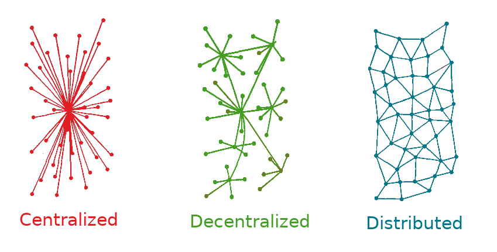
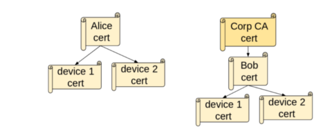
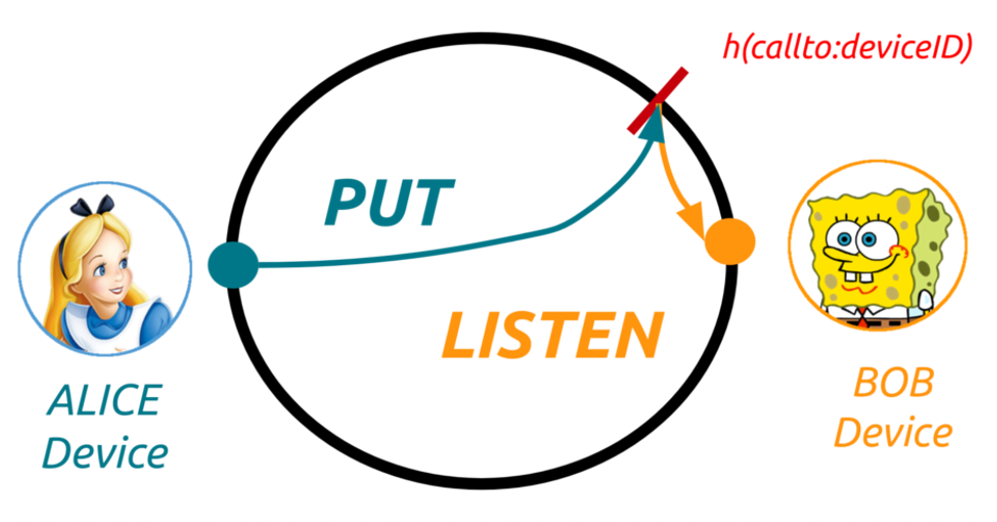
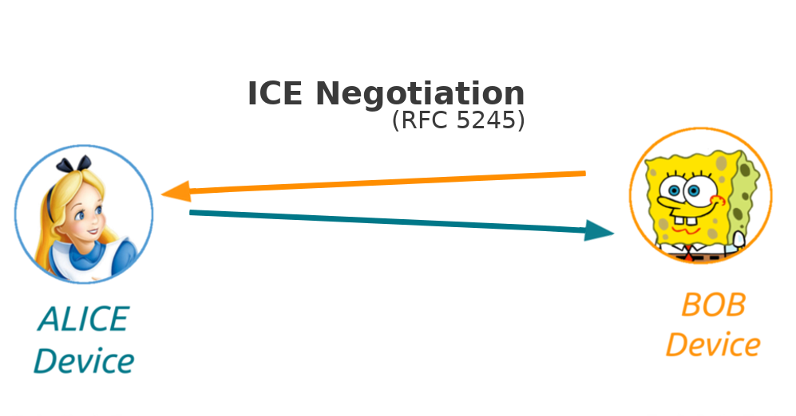
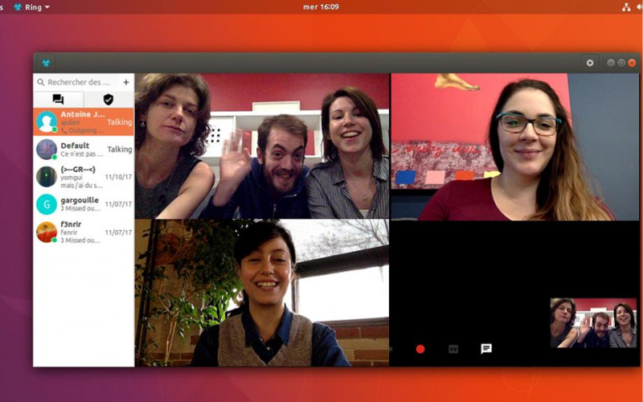
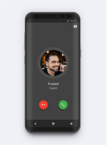
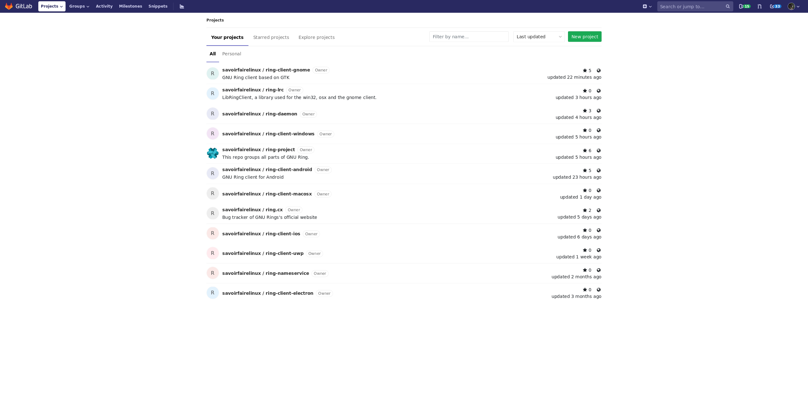
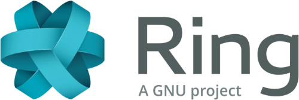

## Ring est une plateforme de communication universelle et libre
### L'état du projet en 2018

[Sébastien (AmarOk) Blin](https://enconn.fr) <sebastien.blin@savoirfairelinux.com>  

<!-- .slide: data-background="./images/bgwhite.png" id="title" -->

---

Ring est une plateforme de communication universelle et libre, respectant les libertés et la vie privée des utilisateurs.

<!-- .slide: data-background="./images/bgwhitewithmesh.png" id="definition" -->

---

## Démo !

<!-- .slide: data-background="./images/bgwhite.png" -->

---

## Distribué ?

<!-- .slide: data-background="./images/bgwhite.png" -->

---

## Un compte Ring c'est quoi ?

+ **Compte** = RSA key pair.
+ **RingID** = empreinte de la clé publique.

*ring:346297f4f3629ae554b92442cc2fde46059f5ac0*

<!-- .slide: data-background="./images/bgwhite.png" -->

---

## Un pseudo optionel, mais facile à retenir

+ Name server : transition pseudo/RingID.
+ On peut en héberger un soi-même.
+ REST API
+ https://ns.ring.cx

<!-- .slide: data-background="./images/bgwhite.png" -->

---

## Communiquons !

<!-- .slide: data-background="./images/bgwhite.png" -->

---

## Communiquons ! (2)

<!-- .slide: data-background="./images/bgwhite.png" -->

---

## Communiquons ! (3)

<!-- .slide: data-background="./images/bgwhite.png" -->

---

## Universel ?

<!-- .slide: data-background="./images/bgwhite.png" -->

---

## Ring en 2018. Nouvelles fonctionnalités !

<!-- .slide: data-background="./images/bgwhite.png" -->

---

## Push notifications, première itération

+ Utilise Firebase (Google) et APN (Apple) dans la première version
+ MQTT distribué pour la seconde version ? (VerneMQ)

<!-- .slide: data-background="./images/bgwhite.png" -->

---

## Transfert de fichiers

+ Pour le moment passe par le serveur TURN configuré.
+ Développement du support TCP pour ICE, permettera le transfert pair à pair.

<!-- .slide: data-background="./images/bgwhite.png" -->

---

## Enregistrement des appels !

<!-- .slide: data-background="./images/bgwhite.png" -->

---

## Ouverture de notre instance GitLab

+ Amélioration de l'accessibilité pour contribuer à Ring.
+ Augmentation du nombre de retours
+ Tickets facile pour les nouveaux arrivants
+ À continuer !

<!-- .slide: data-background="./images/bgwhite.png" -->

---

## Un pipeline FDroid

+ Mise à jour du store FDroid plus rapide

<!-- .slide: data-background="./images/bgwhite.png" -->

---

## La suite ?

<!-- .slide: data-background="./images/bgwhite.png" -->

---

## Conversations de groupes

+ Beaucoup de travail pour ça
+ Changement pour la crypto
+ Transfert de fichiers pair à pair
+ Message offline
+ Synchronisation
+ etc.

<!-- .slide: data-background="./images/bgwhite.png" -->

---

## Améliorations des clients

+ Windows/MacOS/iOS en retard

<!-- .slide: data-background="./images/bgwhite.png" -->

---

## Bridges vers d'autres technologies ?

+ Interopérabilité
+ Bridge Matrix ??

<!-- .slide: data-background="./images/bgwhite.png" -->

---

## Merci

Join the Ring!  
https://ring.cx  
https://git.ring.cx  
\#ring sur freenode !  
ring@gnu.org

<!-- .slide: data-background="./images/bgwhite2.png" -->
