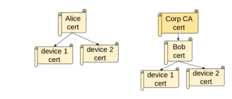
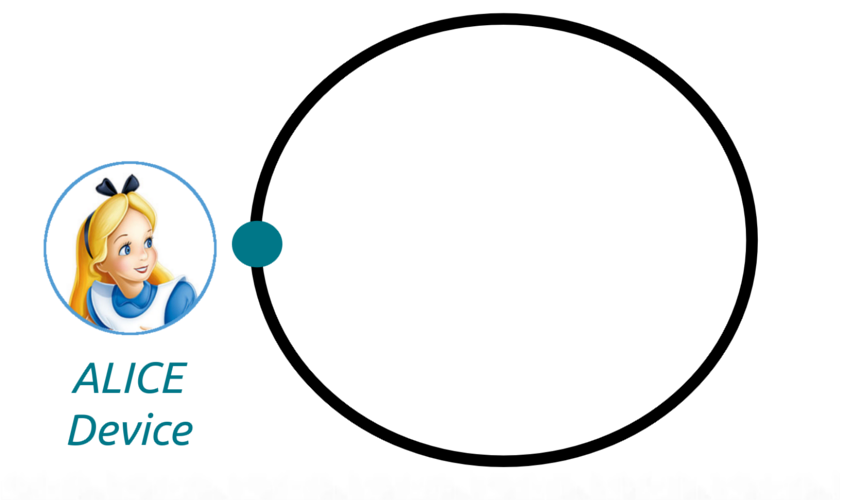
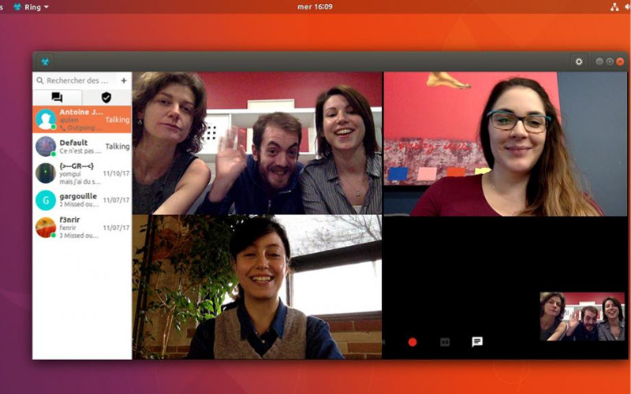
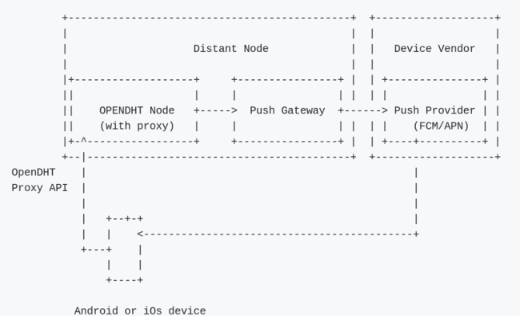

## Ring as a free universal distributed communication platform
### The state of the project in 2018

[Sébastien Blin](https://enconn.fr) <sebastien.blin@savoirfairelinux.com>  
Adrien Béraud <adrien.beraud@savoirfairelinux.com>

<!-- .slide: data-background="./images/bgwhite.png" id="title" -->

---

Ring is a free universal distributed communication platform which respect privacy

<!-- .slide: data-background="./images/bgwhitewithmesh.png" id="definition" -->

---

## Distributed?

<!-- .slide: data-background="./images/bgwhite.png" -->

---

## Generate a Ring account

+ **Account** = RSA key pair.
+ **RingID** = fingerprint of the public key.

*ring:346297f4f3629ae554b92442cc2fde46059f5ac0*

<!-- .slide: data-background="./images/bgwhite.png" -->

---

## Name registration: Ethereum contract

+ Public distributed registrar
+ Name <-> RingID mappings
+ REST API
+ Optional

<!-- .slide: data-background="./images/bgwhite.png" -->

---

## Let's communicate

<!-- .slide: data-background="./images/bgwhite.png" -->

---

## Let's communicate (2)

<!-- .slide: data-background="./images/bgwhite.png" -->

---

## Let's communicate (3)

<!-- .slide: data-background="./images/bgwhite.png" -->

---

## Universal

<!-- .slide: data-background="./images/bgwhite.png" -->

---

## In varietate concordia - new platforms

+ [iOS](https://itunes.apple.com/us/app/ring-a-gnu-package/id1306951055?platform=iphone&preserveScrollPosition=true#platform/iphone)
+ Android TV
+ FDroid

<!-- .slide: data-background="./images/bgwhite.png" -->

---

## In varietate concordia - new features

+ File transfer
+ Push notifications
+ DHT Proxy
+ Improved contact managment

<!-- .slide: data-background="./images/bgwhite.png" -->

---

## Some new 2017 features

<!-- .slide: data-background="./images/bgwhite.png" -->

+ New contact management system and searching item
+ Common database for each platforms
+ Add the ability to change passwords
+ vdpau acceleration support, etc.

---

<!-- .slide: data-background="./images/bgwhite.png" -->

---

## File transfer

<!-- .slide: data-background="./images/bgwhite.png" -->

---

## OpenDHT proxy

+ Use a trusted node as a proxy to LISTEN the DHT
+ Usable via a REST API (see OpenDHT wiki)
+ Avoid synchronization on the device
+ Messages still decrypted by the device, not by the proxy
<!-- .slide: data-background="./images/bgwhite.png" -->

---

## Push notifications

See https://github.com/savoirfairelinux/opendht/wiki/Push-notifications-support
<!-- .slide: data-background="./images/bgwhite.png" -->

---

## 2018 in short (1)

+ Auto video quality: Optimizing the auto video quality algorithm (RTCP/RTSP feedback)
+ A p2p file transfer implementation
+ Redesign of the media system

<!-- .slide: data-background="./images/bgwhite.png" -->

---

## 2018 in short (2)

+ Improve the Telepathy Client
+ Connect Ring to Matrix as well as possible
+ Ring as a WebRTC client

<!-- .slide: data-background="./images/bgwhite.png" -->

---

## 2018 in short (3)

+ Packaging, translation, build scripts, support, testing, design, security verification.
+ ML, IRC, tuleap
+ GSoC

<!-- .slide: data-background="./images/bgwhite.png" -->

---

## Thank you! Questions?

Join the Ring!

https://ring.cx  
https://tuleap.ring.cx/plugins/mediawiki/wiki/ring

<!-- .slide: data-background="./images/bgwhite2.png" -->
